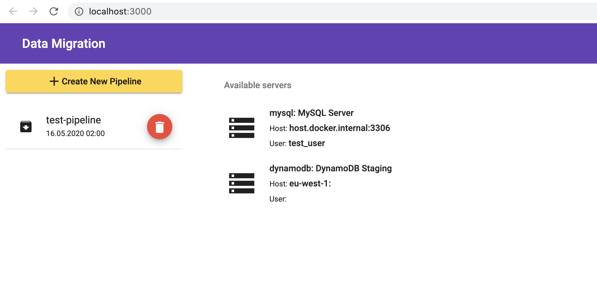
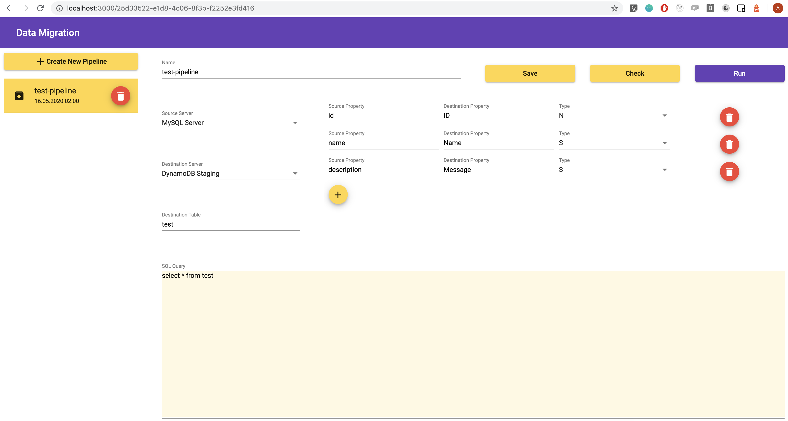

## Data Migration

> Web Application for transferring slices of data between database servers

### Prerequisites

- Install [Docker](https://docs.docker.com/docker-for-windows/install/)

### Available directions

| Sources      | MySQL | DynamoDB |
| ------------ | :---: | :------: |
| **MySQL**    |  🚫   |    ✅    |
| **DynamoDB** |  🚫   |    🚫    |

### Features

#### Check

1. Runs query on source server
1. Maps each row in source server result to the defined structure
1. Returns mapped result

#### Run

1. Runs query on source server
1. Maps each row in source server result to the defined structure
1. Runs query on destination server
1. Returns mapped result

### Get Started

> Server - database server which can be source and/or destination instance. Configured by `config.yaml`

> Pipeline - configured by user process of transfering data between servers, stored in S3 bucket.

#### Create folder, e.g. `data-migration`

```bash
mkdir data-migration
cd data-migration
```

#### Create `config.yaml`

```yaml
storage:
  bucket: data-migration-project-test # AWS S3 bucket name for storing pipelines
  region: eu-west-1 # AWS region
servers:
  - type: mysql # type of server: mysql, dynamodb
    id: mysql-read # unique id of server
    name: MySQL Server # readable name of server in UI
    host: host.docker.internal # server host
    database: test # database schema
    pool: 3 # connection pool
    port: 3306 # server port
    user: test_user # server user
    password: test_password # server password
  - type: dynamodb # type of server: mysql, dynamodb
    id: dynamodb-staging # unique id of server
    name: DynamoDB Staging # readable name of server in UI
    region: eu-west-1 # AWS region of DynamoDB
    profile: AWSProfile # AWS profile
```

#### Create `Dockerfile`

```docker
FROM abezpalov/data-migration:latest
WORKDIR /usr/src/app
COPY config.yaml ./
EXPOSE 3000
CMD [ "node", "dist/index.js" ]
```

#### Build Docker image

```bash
docker build -t data-migration-example .
```

#### Run Docker image

```bash
docker run -e AWS_ACCESS_KEY_ID=<AWS_ACCESS_KEY_ID> -e AWS_SECRET_ACCESS_KEY=<AWS_SECRET_ACCESS_KEY> -p 3000:3000 data-migration-example
```

#### Open in browser [localhost:3000](http://localhost:3000)



